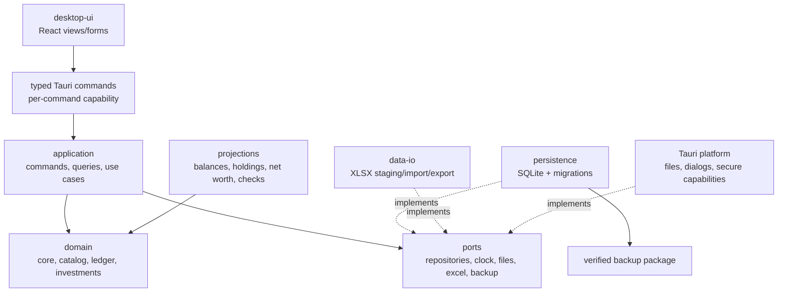

# 多币种个人账本开发计划书

> 状态：调查、v1.3.0 可视化增补与终审完成，M0/M1 实施基线（Ready for M0）
>
> 日期：2026-09-01
>
> 权威迁移源与产品参考：`多币种个人账本v1.3.0.xlsx`
>
> 源文件 SHA-256：`E8B7D7BB743AE79AB51980115CD8BC88DC7E2E149295F56E5B6521BFCDF5F41D`
>
> 目标：本地优先、隐私友好、财务口径可解释、轻量且一人可长期维护的桌面应用

## 1. 执行摘要

本项目不是把 Excel 表格逐页翻译成窗口，而是把现有账本中已经形成的业务规则提炼为一个可测试、可迁移、可恢复的本地应用。

产品定位为：面向单用户的本地优先多币种现金、投资与净资产管理桌面应用；以选定估值日准确回答“钱在哪里、值多少、期间发生了什么、数据是否完整”，并支持从现有 Excel 安全迁移和随时导出。

推荐方案是：

- Windows x64 首发、架构保留跨平台能力；
- Tauri 2 桌面壳、React + TypeScript 界面、SQLite 本地数据库；
- 模块化单体，不设云后端、数据库服务器、后台守护进程、微服务或插件系统；
- UI 继续使用“收支、调拨、换汇、证券交易”等用户熟悉的业务类型；
- 概览内提供“资产概览”和与 v1.3.0 等价但口径更严谨的“支出分析”，不增加顶级导航或重量级图表框架；
- 内部使用“业务事件 + 轻量账本分录 + 可重建投影”，确保现金、持仓和净资产只有一套计算逻辑；
- Excel 仅作为迁移源和导出格式，不能继续充当运行时计算引擎；
- 财务金额禁止使用 JavaScript `number` 或数据库浮点数承担核心计算；
- 原始 Excel 永不修改，导入先进入 staging，完成校验和对账后原子提交；
- SQLite 活库默认放操作系统本地应用数据目录，不能直接放在 OneDrive 等同步盘；同步盘只存一致性备份包。

技术栈最终确认设在里程碑 M1。只有包含 SQLite、Excel 解析、安装包和真实基准测试的样机满足轻量预算，才进入全面开发。若必须内嵌大型 WebView 运行时、Tauri 双语言维护成本失控，或目标 Windows 环境无法可靠提供 WebView2，则反转到 `.NET 10 + Avalonia + SQLite` 的单语言方案。

有三个发布前必须确认的财务决策：

1. 证券卖出后再次买入时采用哪种成本基础；本计划暂定“逐笔移动加权平均”，不照搬会让历史盈亏被未来买入改变的累计平均公式。
2. 是否需要应用级数据库加密；本计划默认本地数据库受操作系统账户和磁盘加密保护，备份包必须可加密，数据库 SQLCipher 支持由威胁模型和 M1 体积测试决定。
3. 早于账户期初日期的证券交易如何切换；必须在“完整历史重建”与“期初现金/持仓/成本桥接”之间逐账户、逐组合选择并对账，不能只导入证券腿或只导入现金腿。

## 2. 调查范围、证据与限制

### 2.1 工作区状态

- 当前目录不是 Git 仓库。
- 未发现 `AGENTS.md`、项目 `README`、源码、架构文档或既有 `docs/`。
- 本计划以根目录的 `多币种个人账本v1.3.0.xlsx` 为权威迁移源和最新产品参考；v1.2.0 仅用于确认版本差异。
- 工作区中出现的其他版本、输出文件和临时分析目录不自动成为需求或迁移源。
- 源目录位于 OneDrive；这不意味着生产 SQLite 活库可以安全地直接置于同步目录。

### 2.2 工作簿结构

v1.3.0 包含 14 个可见工作表、11 个 Excel 结构化表、约 10,533 个 OOXML 公式元素和 2 个图表。未发现 VBA、外部工作簿链接、数据连接、透视缓存或隐藏工作表。与 v1.2.0 对比，原有 13 张工作表的公式矩阵保持一致；产品功能增量集中在新增“支出分析”页。

脱敏聚合后的真实输入规模约为：14 个机构、25 个资金子账户、5 条汇率、53 条收支、19 个分类、2 条同币种调拨、0 条换汇、5 个证券组合、5 个证券标的、16 条证券交易和 5 行持仓。真实数据没有换汇案例，因此换汇不能仅靠源文件验收，必须依赖合成黄金样例。

| 领域 | 工作表 | 作用 |
|---|---|---|
| 输出 | 说明与仪表盘 | 估值日、净资产、月度收支、机构/币种汇总和异常摘要 |
| 输出 | 支出分析（v1.3.0 新增） | 自定义日期范围、支出 KPI、分类排名图、分类明细与可审计辅助区 |
| 主数据 | 机构 | 金融机构、地区、类型、启用状态 |
| 主数据 | 资金子账户 | 机构、用途、币种、期初余额和估值余额 |
| 主数据 | 分类 | 收支分类及收入/支出属性 |
| 市场数据 | 汇率 | “1 单位原币 = CNY”的日期序列 |
| 现金事件 | 收支流水 | 收入、支出、调整和相关手续费 |
| 现金事件 | 资金调拨 | 同币种账户间转移 |
| 现金事件 | 换汇流水 | 跨币种本金和手续费 |
| 投资主数据 | 证券组合 | 机构和证券结算子账户的关联 |
| 投资主数据 | 证券标的 | 标的、币种、最新价格和估值汇率 |
| 投资事件 | 证券 基金 理财交易 | 买入、卖出、股息和费用 |
| 投影 | 持仓 | 数量、成本、市值、已实现/未实现收益 |
| 质量 | 检查 | 缺汇率、缺价格、映射错误、负持仓等 |

### 2.3 v1.3.0 新增“支出分析”证据

新增工作表使用 `A1:AC304`，可见展示区位于 `A1:M32`，右侧保留公式辅助区。它不是新的业务数据源，而是基于分类、收支流水和换汇手续费数据构建的输出页。

| 能力 | v1.3.0 表现 | 应用要求 |
|---|---|---|
| 日期范围 | 开始日、结束日，范围含首尾两日 | 首次进入默认本月至今（MTD），P0 只保留明确的开始/结束日自定义；范围含首尾 |
| 状态 | 正常、日期范围无效、期间无支出 | 对应明确空态/错误态，不保留旧图或假零值 |
| KPI | 总支出、支出笔数、最大支出分类及金额、退款/报销金额 | 每个 KPI 能下钻；缺 FX 时总额改标“已折算支出小计”，并分别展示未折算支出/退款笔数与计算版本 |
| 分类排行 | 金额降序的横向条形图 | 默认 Top 10 正金额分类 +“其余分类”合计；排序稳定、金额单位明确 |
| 分类明细 | 分类、支出 CNY、占比、笔数 | 表格是图表的可访问等价物，金额、占比、笔数与图形共享同一 query result |
| 退款/报销 | 单独展示，不抵扣分类支出 | 以明确 semantic role/tag 识别，不依赖分类名称恰好等于“退款” |
| 对账 | 分类金额之和与总支出一致 | 完整时 `sum(bucket rows) = total expense`；缺 FX 时 `sum(valued bucket rows) = valued subtotal`，两者均为自动化不变量 |
| 审计 | 页面右侧保留分类、流水和换汇费辅助区 | 应用不展示公式辅助表，但可从任一数字下钻到事件、FX resolution 和分类规则 |

Excel 页面的默认口径是按交易日折算到 CNY，纳入普通支出、普通手续费和换汇手续费；收入、调拨本金、换汇本金、证券交易本金及证券相关费用不进入分类支出。应用沿用“排除本金、退款单列”的产品意图，但不复制固定行号和公式缺口；所有包含项必须由同一只读查询口径产生。

### 2.4 关键计算链

资金子账户估值日余额可概括为：

```text
期初余额
+ 收入
- 支出
- 手续费
+ 调整
- 同币种调拨转出 + 同币种调拨转入
- 换汇转出 + 换汇转入
- 换汇手续费
+ 证券交易现金变动
```

其他已验证规则：

- CNY 汇率固定为 1。
- 非 CNY 汇率取目标日期当日或此前最近一条，并允许逐笔覆盖。
- 交易日汇率用于流水折算；仪表盘估值日汇率用于资产估值。
- 同币种调拨不计收入或支出。
- 换汇本金不计收入或支出，换汇手续费计入期间支出。
- 证券买入产生负现金变动，卖出和股息产生正现金变动，费用产生负现金变动。
- 净资产 = 资金子账户当前估值 + 证券持仓当前市值。
- 机构汇总同时包括现金子账户和该机构所属持仓，但证券结算现金与持仓不重复。
- 缺失必要汇率或价格时，资产应明确标记为未估值，不能按 1:1 假装成 CNY。

### 2.5 调查限制

第三方工作簿渲染器对部分 Excel 结构化引用和跨表公式计算不完全兼容，预览中出现的 `#NAME?` 不能直接认定为源文件损坏。迁移验收必须结合：

- XLSX 内的 OOXML 公式文本；
- 用户在桌面 Excel 中完成全量重算并保存后的结果；
- 脱敏黄金样例；
- 应用导入后的逐项对账报告。

报告和测试夹具不得复制真实姓名、商户、备注、完整账号或私人流水。

### 2.6 必须显式解决的现有口径缺口

- 账户余额公式累计所有 `date <= valuation_date` 的事件，但没有使用开户/期初日期作为下界，也没有按启用状态过滤。已有若干证券交易早于关联账户的期初日期；期初余额的 cut-over 语义是 M0 blocker。
- Excel 的“最近汇率”实际上依赖表格行序，取最后一个符合条件的行，而不是严格查询最大日期；同币种同日重复值会静默 last-row-wins。应用必须改为日期索引查询、正数校验和 `(currency,date)` 唯一约束。
- 普通收支的账户币种、折算值和部分金额来自公式；部分看似输入的金额单元格本身也是算术公式。导入必须同时保存原公式文本和缓存数值，不能把公式字符串当金额。
- 分类不是现有公式的硬必填项，也未验证“分类方向=流水类型”。源数据存在需要人工判定的方向不一致，应用默认将方向设为硬约束，迁移时给出问题清单。
- 独立的证券“费用”操作会减少结算现金，但现有持仓总回报没有纳入该费用。新引擎必须将费用计入投资净回报。
- 证券标的仅保存一条最新价格，估值时没有严格验证 `price_date <= valuation_date`。应用从第一天保存价格历史，并按估值日前最近值查询。
- 仪表盘资产严格截至估值日，但“本月”公式统计到该自然月月末。应用默认显示“截至估值日的 MTD”，完整自然月另作期间报表，避免月中估值混入未来流水。
- 证券标的当前隐含只属于一个组合，持仓又只按标的代码聚合。应用必须用全局 `SecurityInstrument` 和 `(portfolio_id,instrument_id)` 持仓键，避免同一标的跨组合串仓。
- 个别交易使用的结算账户不同于组合默认账户但币种有效。应用允许受控覆盖，但必须记录原因，不能静默改写为默认账户。
- v1.3.0 的支出分类辅助公式只纳入当前“启用”的支出分类，停用分类可能从历史分析中消失；应用必须保留归档分类的历史金额并标记“已归档”。
- v1.3.0 的总金额 `B6=SUM(O7:O62)` 已包含未分类金额 `O61` 和换汇手续费 `O62`，但总笔数 `D6=SUM(P7:P27)` 漏掉后续分类、未分类 `P61` 与换汇手续费 `P62`；应用必须动态聚合并在差异桥中逐事件解释，不能复制固定行界。
- v1.3.0 只枚举当前启用分类，已归档分类可能从历史金额、笔数和排行消失；应用按稳定 `category_id` 保留历史并显示“已归档”。
- v1.3.0 以“收入 + 分类名称恰为退款”识别标为“退款/报销”的 KPI；应用分别使用稳定的 `refund` / `reimbursement` 语义或显式关系识别，重命名后结果不变。
- v1.3.0 的流水公式支持“手续费/调整”，但源表数据验证与之不完全一致；应用将调整排除出消费支出，并在 ADR-0006 固定修订/冲正的期间语义。

## 3. 产品定义

### 3.1 目标用户

首版只有一个主要用户：账本所有者本人。其特点是持有多个国家/地区的银行、电子钱包、现金和证券账户，希望手工维护可信的资产全貌，重视隐私、可解释性和可迁移性，不希望运行服务器或维护复杂基础设施。

### 3.2 核心 Jobs to Be Done

1. 我想快速记录一笔收支，并立即知道它影响哪个账户和本月现金流。
2. 我想区分账户调拨、换汇和真实收入/支出，避免统计失真。
3. 我想在指定日期查看不同机构、币种和投资的总资产。
4. 我想记录证券买卖、股息和费用，并获得稳定、可解释的持仓收益。
5. 我想选择一段时间查看支出总额、分类排行和笔数，并从 KPI 或分类明细直接下钻到构成流水。
6. 我想知道哪些汇率、价格、映射或流水不完整，并能直接修复。
7. 我想从 Excel 迁移，同时证明迁移前后关键数字一致。
8. 我想离线使用、自己备份，并能在应用不可用时取回通用格式数据。

### 3.3 产品目标

- 正确：所有余额和收益可追溯到业务事件，关键财务规则有自动化测试。
- 可解释：每个汇总数字能下钻到事件、汇率、价格和舍入过程。
- 轻量：单机、单一可部署桌面应用、无应用自建后台服务/守护进程，按完整进程树控制体积与资源，并保持少依赖、少页面。
- 私密：默认零网络依赖，真实财务数据不进入日志、遥测或云端。
- 可恢复：写入原子化，迁移前自动备份，恢复流程经过实际演练。
- 可维护：模块边界清晰，领域逻辑只有一份，可重建派生数据。

### 3.4 成功指标

| 指标 | 1.0 目标 |
|---|---|
| Excel 迁移 | 关键对账项无未解释差异；所有跳过/修正均有报告 |
| 日常录入 | 熟练用户完成普通收支录入的中位时间不超过 15 秒 |
| 支出分析 | 完整时总额=分桶合计，缺 FX 时已折算小计=已折算分桶合计；筛选或下钻 P95 ≤ 200 ms；无静默漏计 |
| 数据完整性 | 保存时即时提示阻断错误；概览可见全部未解决异常 |
| 离线能力 | 核心功能断网 100% 可用；无登录和云依赖 |
| 恢复能力 | 用户可在 10 分钟内从有效备份恢复；发布前完成真实恢复演练 |
| 财务回归 | 黄金样例和源账本对账测试全部通过 |
| 维护性 | 一条命令完成检查和测试，一条命令构建安装包 |
| 轻量预算 | M1 锁定并在每次候选发布中自动/人工复测 |

## 4. “轻量化”的发布门禁

轻量化与正确性、可恢复性并列为发布门禁。不能通过删除测试、审计或备份能力来换取更小体积；应削减的是非核心平台、服务、页面、运行时依赖和首版范围。

参考测试环境为 4 核 CPU、8 GB 内存、SSD 的 Windows x64 设备。数据集包括当前账本和 10 万业务事件的脱敏合成数据。Tauri/WebView2 等桌面壳天然可能产生多个操作系统进程，因此所有 CPU、RSS 和退出检查都以本应用启动的**完整进程树**为口径，而不是把“单进程”当成虚假目标。

### 4.1 与技术栈无关的硬门禁

| 维度 | 1.0 硬目标 | Stretch 目标 | 验证方式 |
|---|---:|---:|---|
| 部署模型 | 一个可安装桌面应用；无数据库服务器、应用自建服务或后台守护进程 | 同左 | 干净系统安装与进程树检查 |
| 离线 | 核心功能零网络可用 | 更新也可手动完成 | 断网 E2E |
| 标准薄安装包/应用增量 | ≤ 30 MiB，按同口径排除设备已预装 runtime | ≤ 20 MiB | 两个候选栈均按相同口径计量 |
| 安装后应用载荷 | ≤ 75 MiB，不含预装 runtime 和用户数据 | ≤ 50 MiB | 安装目录逐文件计量 |
| 完全离线/运行时内含包 | 若发布，必须另报下载体积和安装占用；不得替代标准薄包指标 | 越小越好 | 干净离线机器实测 |
| 冷启动至可交互 P95 | ≤ 1.5 秒 | ≤ 1.0 秒 | 连续 30 次，记录机器和版本 |
| 闲置完整进程树 RSS P95 | ≤ 150 MB | ≤ 100 MB | 启动后 5 分钟稳态测量 |
| 关闭后应用进程树 | 0 个残留进程 | 同左 | 退出后 10 秒检查 |
| 常规保存/筛选/切页 P95 | ≤ 200 ms | ≤ 150 ms | 性能测试 |
| 10 万事件账户/时间线查询 P95 | ≤ 1 秒 | ≤ 500 ms | 合成数据基准 |
| 当前工作簿导入 | ≤ 10 秒且 UI 不冻结 | ≤ 5 秒 | 集成基准 |
| 当前数据集数据库 | ≤ 20 MB，不含附件/备份 | ≤ 10 MB | 文件计量 |
| 10 万事件数据库 | ≤ 100 MB | ≤ 70 MB | 文件计量 |
| 默认运行时网络请求 | 0；更新检查必须由用户显式启用或触发 | 0 | 断网与网络抓取测试 |
| clean clone 到测试+打包 | ≤ 10 分钟 | ≤ 5 分钟 | CI 计时 |

### 4.2 维护预算与 Tauri 条件性护栏

| 维度 | 1.0 预算 | 适用条件 |
|---|---:|---|
| 直接生产依赖 | ≤ 25 个，逐项说明体积、许可证、安全和替代性 | 所有候选栈 |
| 首屏压缩资源 | ≤ 1.2 MiB；Excel/图表按需加载 | ADR-0001 接受 Tauri 时 |
| Tauri 官方插件 | ≤ 8 | ADR-0001 接受 Tauri 时 |
| 特权 IPC 领域命令 | ≤ 25，逐项具名授权 | ADR-0001 接受 Tauri 时 |
| 支出分析页面增量 | 新增 npm/Rust crate/Tauri plugin/Avalonia package 为 0；路由 gzip ≤ 15 KiB、前端总增量 gzip ≤ 20 KiB、薄安装包增量 ≤ 100 KiB | P0；同一构建前后实测 |

M1 可以根据两套真实样机**一次性**重定基线，并由用户在 ADR-0001 中接受；从 ADR-0001 进入 `Accepted` 起，硬门禁不能由普通 ADR 豁免，候选发布任一硬目标失败即阻断发布。只有用户明确批准的平台或产品范围变化才能重新定基线；Stretch 目标可以在说明原因后波动，但必须留下趋势记录。

## 5. 产品范围

### 5.1 P0：MVP / 1.0

| 功能域 | 必须交付的能力 | 核心验收 |
|---|---|---|
| 首次设置 | 新建空账本或导入 Excel；设置本位币 | 出现首条依赖记录后本位币不可原地修改；变更须新建账本并显式迁移 |
| 机构与账户 | 机构、现金/结算账户、币种、用途、启停 | ID 和“机构+用途+币种”约束可检查，不允许悬空映射 |
| 分类 | 收入/支出分类、排序、启停 | 交易类型与分类属性不一致时阻断保存 |
| 汇率 | 历史汇率、来源、按日查找、逐笔覆盖 | 只使用目标日期当日或此前最近值；缺失时不估值 |
| 收支 | 收入、支出、调整、手续费 | 金额符号、必填项、分类和账户币种即时校验 |
| 调拨 | 同币种账户转移 | 转出=转入；不进入收入/支出；账户不得相同 |
| 换汇 | 跨币种本金、手续费、影响预览 | 本金不进入收入/支出；手续费按自身币种折算 |
| 投资主数据 | 组合、证券、价格历史 | 组合机构与结算账户机构一致；缺价格显式提示 |
| 投资交易 | 买入、卖出、股息、费用 | 现金和数量分录原子生成；不得静默形成负持仓 |
| 持仓与收益 | 数量、成本、市值、已/未实现收益 | 逐笔可解释；卖出后再次买入不改变已锁定历史收益 |
| 活动时间线 | 统一查询、筛选、搜索、详情 | 可从汇总下钻到事件；真实数据默认不进入诊断日志 |
| 更正与冲正 | 修改草稿、修订/冲正已过账事件 | 旧版本可追踪；冲正后净影响为零 |
| 估值与概览 | 净资产、机构/币种汇总、月度收支、持仓 | 估值日可切换；未估值项目单列，不按 1:1 处理 |
| 支出分析（v1.3.0） | 默认 MTD/自定义日期、KPI、Top 10+其他分类横条图、明细表、退款/报销单列、下钻 | 日期含首尾；完整/缺 FX 两套不变量成立；本金和投资费用排除；归档分类保留历史 |
| 数据质量 | 缺汇率、缺价格、负持仓、重复/映射错误 | 每条异常有定位、原因、修复入口和状态 |
| Excel 导入 | 一次性初始迁移、dry-run、映射、预检、对账、原子提交 | 失败不污染正式账本；同一字节文件重跑幂等 |
| 导出 | Excel/CSV 和对账报告 | 通用格式可在没有本应用时读取 |
| 备份恢复 | 手动、迁移前、每日及正常退出一致性备份；可加密“数据库+设置+manifest”便携包与保留策略 | P0 包保留附件链接文本但不复制附件文件；恢复到临时位置验证后再切换 |

### 5.2 P1：1.x

- 托管附件，并把附件文件内容纳入 P0 已有的便携备份包；P0 包只包含数据库、设置、manifest 和数据库中的附件链接文本。
- 汇率和价格的批量导入模板。
- 常用交易模板和重复录入辅助，但不自动过账。
- 支出分析的更多历史图表、账户/币种/机构等筛选，以及可选“总费用”视图；后者才评估纳入买卖手续费、股息手续费/预扣税和独立投资费用。
- 自动更新及第二个桌面平台。
- 可选应用级数据库加密（若未进入 P0）。
- 企业行为支持：拆股、合并、证券代码变更等。

### 5.3 P2 / 明确非目标

- 银行或 Open Banking 实时同步。
- 券商交易接口和实时行情。
- 云账户、跨设备实时同步和多人协作。
- 手机端。
- 自动报税或税务成本法保证。
- 复杂预算、目标管理和预测。
- 插件系统、脚本市场、通用会计科目 UI。
- 微服务、消息队列、远程数据库或数据仓库。

任何 P1/P2 功能提前进入 1.0，都必须同时削减等量 P0 范围，或通过 ADR 接受延期和轻量预算变化。

## 6. 信息架构与关键流程

### 6.1 五个顶级入口

1. **概览**：页内切换“资产概览 / 支出分析”；前者展示估值日、净资产、月度收支、资产构成和异常待办，后者实现 v1.3.0 期间分类分析。
2. **活动**：统一时间线；全局新增收支、调拨、换汇、证券交易或调整。
3. **资产**：现金账户、组合、持仓和证券，通过页内标签组织。
4. **数据质量**：缺汇率、缺价格、负持仓、映射、重复和导入问题。
5. **设置与数据**：本位币、机构、分类、汇率/价格参考数据、导入导出、备份恢复和诊断。

避免为每张 Excel 工作表建立一个顶级导航入口。

### 6.2 核心流程

#### 首次导入


#### 日常录入

用户选择业务类型，表单即时显示账户、币种、汇率、现金和持仓影响；保存时在一个 SQLite transaction 中写入业务事件、类型明细、分录和审计记录，然后刷新投影。

#### 更正

草稿可以直接修改；已过账事件不物理覆盖。用户查看受影响余额/收益后创建修订或冲正，旧事件保持可追踪。

#### 估值与月末检查

选择估值日，系统列出缺失汇率/价格和其他异常；用户补齐后确认估值快照或导出报告。快照是缓存和审计锚点，不是唯一事实来源。

### 6.3 支出分析页面规格

为保持轻量化，“支出分析”是“概览”内的次级标签，不新增顶级入口。首次进入把本地当月首日至“今天”解析为明确日期；用户可直接修改开始/结束日并提交，P0 不增加预设菜单。宽窗口使用左侧图表、右侧明细；窄窗口把明细堆叠到图表下方。页面由一个 Rust/C# query 返回同一份规范化结果，React 不自行重算 KPI 或 Top 10。

#### P0 口径

```text
期间支出
= 普通支出
+ 普通手续费
+ 换汇手续费

排除：收入、调整、调拨本金、换汇本金、证券买卖本金、买卖手续费、
      股息毛收入/手续费/预扣税、独立投资费用
退款/报销：单独汇总，默认不冲减原消费分类
```

- P0 有意与 v1.3.0 保持同范围：投资相关费用只进入投资净回报，不进入消费支出；P1 的可选“总费用”视图再通过 ADR 明确是否纳入，避免同一费用被重复计算。
- 所有金额使用事件有效日对应并已保存的 `FxResolution` 折算到本位币；缺 FX 的行不按零处理，而是进入未折算集合并链接数据质量修复。
- 普通支出/手续费使用用户分类；换汇手续费进入不可删除但可本地化显示的系统桶，空分类进入“未分类费用”。每个已折算 P0 支出贡献恰好属于一个桶。
- 分类停用只影响新录入，不影响历史分析；显示名称后附“已归档”。
- 退款和报销在内部使用不同的 `semantic_role`，页面可合并为一个 KPI；按其自身 `effective_date` 进入期间，关联原消费仅用于下钻/未来净额视图，不回写原消费期间。
- 查询只纳入当前事件水位下修订链的有效版本；被替代版本以及成对完成的账务冲正不作为消费或退款贡献。商户退款/报销必须使用退款语义，不能伪装成账务冲正。旧导出通过事件水位和策略版本保持可复现。
- 总支出笔数是“至少有一个已折算、正支出贡献”的全局 `COUNT(DISTINCT event_id)`；未折算项、退款/报销和排除项不计。每个桶的笔数是该桶局部 `COUNT(DISTINCT event_id)`；同一事件可跨多个桶，因此桶笔数之和不要求等于总笔数。
- 排名按本位币金额降序，其次按 category sort_order、稳定 ID 排序；同一已折算正金额数据集产生 KPI、全部桶、Top 10 和“其余分类”，明细可以展开全部。
- 点击 KPI 或表格中的分类按钮打开活动时间线，并携带相同日期、事件类型、分类/系统桶和估值口径过滤器；返回后保留筛选状态。横条只做视觉重复，不承担唯一交互。
- `ExpenseAnalysisQueryResult` 至少携带 resolved start/end、base currency、已折算小计、全局 distinct 笔数、全部桶及其局部 distinct 笔数、退款/报销、未折算支出数、未折算退款/报销数、下钻事件 ID、event watermark、calculation/bucket/refund policy version 和规范结果哈希。金额以规范十进制字符串、占比/条宽以整数基点跨 IPC，UI 不解析后重新累加财务金额。

#### 状态与验收

| 状态 | 行为 |
|---|---|
| 日期缺失、非法或开始日 > 结束日 | 阻止查询，显示关联字段的“日期范围无效”，清空旧 KPI/图表；日期是本地日历日并含首尾 |
| 有未折算项目 | 优先显示“不完整”；总额标签改为“已折算支出小计”，支出与退款/报销未折算笔数分列，不把缺失值算作 0；提供修复入口 |
| 无已折算支出且无未折算项目 | 显示零值 KPI 和解释性空态，不绘制空坐标轴；最大分类为 `null`，不保留旧值 |
| 超过 10 个正金额分类 | 图表显示 Top 10 + 其余合计，表格可展开全部 |
| 图表不可用/辅助技术 | 完整语义表格仍可操作；分类下钻使用真实 `<button>`，结果更新通过礼貌 live region 宣告 |

状态优先级固定为 `invalid > incomplete/unvalued-only > no-valued-spend > normal`。完整时断言 `sum(bucket amounts)=total expense`；不完整时断言 `sum(valued bucket amounts)=valued subtotal`。Top 10 +“其余分类”与完整明细必须来自同一已折算数据集。

视觉上沿用 v1.3.0 的深蓝标题带、青绿色数据强调、横向排名条和紧凑 KPI 层级，但使用设计 token 和 11 行原生 HTML/CSS Grid/Flex 横条，不复制 Excel 的辅助网格或固定 304 行容量。横条是语义表格的重复装饰并可 `aria-hidden`；金额、占比和笔数始终以文字呈现，颜色不是唯一编码。P0 不引入 Canvas、D3、ECharts、Recharts 或任何新图表运行时依赖。

## 7. 领域模型与业务不变量

### 7.1 推荐账本内核

采用“类型化业务事件 + 内部轻量分录 + 可重建投影”。

- 机构、账户、分类等主数据，类型化且不可原地改写财务影响的 `BusinessEvent + Detail`，以及市场数据修订记录共同构成源事实。
- `LedgerPosting` 是由业务事件确定性生成的派生记录：可以为查询性能在同一事务中物化，但不能独立新建、修改或删除，并且必须能从源事件重建。
- 账户余额、持仓、月度收支、净资产和质量检查都是带 `projection_version` 与事件水位的投影，不是第二套真相源。
- 已过账事件通过 `supersedes_event_id` 或 `reverses_event_id` 形成修订链；旧事件和旧计算版本保持可追踪。
- 在 Tauri 候选实现中，Rust Core 接收“记录一笔收支/调拨/换汇/投资事件”等高层命令并权威生成或复核分录；TypeScript 只做界面与即时体验校验。若采用 Avalonia，同一职责由 C# Core 承担。任何候选栈都只能有一份权威财务规则。
- 源事件、其派生分录和投影水位更新在同一 SQLite transaction 中完成；Domain 不依赖 UI、SQLite、Tauri 或 XLSX 库。

不推荐的两个极端：

- 完全复制 Excel 的多表 SUMIFS：实现快，但业务逻辑重复且容易漂移。
- 首版构建企业级复式会计平台：审计性强，但会显著扩大概念、UI 和维护成本。

### 7.2 实体与查询契约

| 实体/契约 | 类型 | 关键字段/约束 |
|---|---|---|
| AppSettings | 源数据 | base_currency、locale、valuation_defaults；出现首条依赖记录后 base_currency 不可原地修改 |
| Institution | 源数据 | UUID、业务 ID、名称、地区、类型、enabled |
| CashAccount | 源数据 | UUID、institution_id、purpose、currency、opened_on（可选元数据）、enabled；业务 ID 唯一，账户字段不承载期初金额 |
| OpeningBalanceDetail | 事件明细 | event_id、account_id、balance_amount、cutover_date、migration_policy；期初余额通过事件进入账本 |
| Category | 源数据 | UUID、name、kind、semantic_role(normal/refund/reimbursement)、sort_order、enabled；name+kind 唯一，语义不依赖显示名 |
| FxRateRevision | 源数据 | UUID、date、currency、base_currency、rate_to_base、source、revision、active；可保留多版本，但每币种/日期只能有一个 active |
| FxResolution | 审计事实 | owner_type/id、purpose(transaction/fee/valuation)、target_date、currency/base_currency、auto_rate_revision_id、override_value/reason、final_rate、calculation_version |
| Portfolio | 源数据 | UUID、institution_id、settlement_account_id、type、enabled |
| SecurityInstrument | 源数据 | UUID、code、name、trade_currency、enabled；不直接从属于单一组合 |
| SecurityPriceRevision | 源数据 | UUID、instrument_id、date、price、price_currency、source、revision、active；每标的/日期只能有一个 active |
| BusinessEvent | 源数据 | UUIDv7、event_type、effective_date、sequence、status、revision、supersedes_event_id、reverses_event_id、created_at、import_batch_id |
| IncomeExpenseDetail | 源数据 | event_id、account_id、type、category_id、amount、merchant、note、attachment refs |
| TransferDetail | 源数据 | event_id、from_account_id、to_account_id、amount |
| CurrencyExchangeDetail | 源数据 | event_id、from/to account、from/to amount、fee account/amount、FX overrides |
| SecurityTradeDetail | 源数据 | BUY/SELL：portfolio/instrument/settlement account、quantity、unit_price、trade_fee |
| DividendDetail | 源数据 | portfolio/instrument/settlement account、gross_cash_amount、withholding_tax、fee；数量不变，不强迫编码为 quantity×price |
| InvestmentExpenseDetail | 源数据 | portfolio/settlement account、cash_amount、fee_scope(instrument/portfolio)、instrument_id（按 scope 可空）；数量不变 |
| OpeningPositionDetail | 事件明细 | portfolio_id、instrument_id、quantity、carrying_cost、cost_currency、cutover_date、migration_policy |
| OpeningPerformanceDetail | 事件明细 | portfolio_id、instrument_id（组合级可空）、realized_trade_pnl、net_dividend、independent_expense、currency、cutover_date；不改变现金/数量 |
| LedgerPosting | 确定性派生 | event_id、account/commodity、quantity_delta、base_value、base_currency、posting_kind、calculation_version；不可独立编辑 |
| HoldingProjection | 可重建投影 | portfolio_id+instrument_id、as_of、quantity、cost、realized_trade_pnl、net_dividend、independent_expense、unrealized_pnl、projection_version |
| ExpenseAnalysisQueryResult | 非持久化查询契约 | resolved dates、base currency、valued subtotal、global/bucket distinct counts、bucket rows、refund/reimbursement、unvalued counts、drilldown IDs、event watermark、policy/calculation versions、canonical hash |
| ValuationSnapshot | 缓存/审计 | valuation_date、base_currency、calculation_version、summary、source watermarks；重新计算产生新版本，不覆盖旧快照 |
| ValuationSnapshotLine | 审计明细 | snapshot_id、asset/account、native_value/currency、price_revision_id、fx_resolution_id、base_value/base_currency、valued/unvalued reason |
| Attachment | 源数据 | UUID、event_id、relative_path、hash、mime、size；P1 托管文件 |
| ImportBatch/ImportRow | 审计/staging | source hash、sheet、row、raw/normalized values、status、errors、importer version |
| AuditEvent | 源数据 | actor=local user、action、entity/version、timestamp、reason；不得保存敏感内容副本 |

### 7.3 ER 图

```mermaid
erDiagram
  INSTITUTION ||--o{ CASH_ACCOUNT : owns
  INSTITUTION ||--o{ PORTFOLIO : owns
  CASH_ACCOUNT ||--o{ PORTFOLIO : settles
  SECURITY_INSTRUMENT ||--o{ SECURITY_PRICE_REVISION : priced_by
  PORTFOLIO ||--o{ SECURITY_TRADE_DETAIL : scopes
  SECURITY_INSTRUMENT ||--o{ SECURITY_TRADE_DETAIL : traded_as
  PORTFOLIO ||--o{ OPENING_POSITION_DETAIL : opens
  SECURITY_INSTRUMENT ||--o{ OPENING_POSITION_DETAIL : seeds
  BUSINESS_EVENT ||--o| INCOME_EXPENSE_DETAIL : specializes
  BUSINESS_EVENT ||--o| TRANSFER_DETAIL : specializes
  BUSINESS_EVENT ||--o| CURRENCY_EXCHANGE_DETAIL : specializes
  BUSINESS_EVENT ||--o| SECURITY_TRADE_DETAIL : specializes
  BUSINESS_EVENT ||--o| DIVIDEND_DETAIL : specializes
  BUSINESS_EVENT ||--o| INVESTMENT_EXPENSE_DETAIL : specializes
  BUSINESS_EVENT ||--o| OPENING_BALANCE_DETAIL : specializes
  BUSINESS_EVENT ||--o| OPENING_POSITION_DETAIL : specializes
  BUSINESS_EVENT ||--o| OPENING_PERFORMANCE_DETAIL : specializes
  BUSINESS_EVENT o|--o| BUSINESS_EVENT : supersedes_or_reverses
  BUSINESS_EVENT ||--o{ LEDGER_POSTING : generates
  BUSINESS_EVENT ||--o{ FX_RESOLUTION : applies
  BUSINESS_EVENT ||--o{ AUDIT_EVENT : audited_by
  BUSINESS_EVENT ||--o{ ATTACHMENT : references
  CATEGORY ||--o{ INCOME_EXPENSE_DETAIL : classifies
  CASH_ACCOUNT ||--o{ OPENING_BALANCE_DETAIL : opens_with
  CASH_ACCOUNT ||--o{ INCOME_EXPENSE_DETAIL : records
  CASH_ACCOUNT ||--o{ TRANSFER_DETAIL : transfers
  CASH_ACCOUNT ||--o{ CURRENCY_EXCHANGE_DETAIL : exchanges
  CASH_ACCOUNT ||--o{ SECURITY_TRADE_DETAIL : settles
  CASH_ACCOUNT ||--o{ DIVIDEND_DETAIL : receives
  CASH_ACCOUNT ||--o{ INVESTMENT_EXPENSE_DETAIL : pays
  CASH_ACCOUNT ||--o{ LEDGER_POSTING : receives
  FX_RATE_REVISION ||--o{ FX_RESOLUTION : selected_by
  PORTFOLIO ||--o{ HOLDING_PROJECTION : owns
  SECURITY_INSTRUMENT ||--o{ HOLDING_PROJECTION : projects
  PORTFOLIO ||--o{ OPENING_PERFORMANCE_DETAIL : carries_history
  SECURITY_INSTRUMENT o|--o{ OPENING_PERFORMANCE_DETAIL : attributes
  VALUATION_SNAPSHOT ||--|{ VALUATION_SNAPSHOT_LINE : contains
  FX_RESOLUTION ||--o{ VALUATION_SNAPSHOT_LINE : converts
  IMPORT_BATCH ||--o{ IMPORT_ROW : stages
  IMPORT_BATCH ||--o{ BUSINESS_EVENT : creates
```



### 7.4 不变量

- 所有财务事件必须具有本地日历日期；创建/修改时间使用 UTC 时间戳。
- 账本出现首条依赖记录后，`base_currency` 不可原地修改；CashAccount 已有事件后不得改 currency，SecurityInstrument 已有价格/交易后不得改 trade_currency。币种变更通过新账本/账户/标的和显式迁移完成，不能重解释历史。
- 同日多笔证券交易必须有稳定 sequence；Excel 导入默认使用源行顺序。
- 汇率方向统一为 `1 单位原币 = 本位币`，不在代码中混用倒数。
- 汇率修订、汇率解析、posting、价格修订和估值快照都显式保存其 currency/base_currency 身份，不能只依赖当前可变主数据推断历史单位。
- 汇率可保留不可变修订，但数据库用 partial unique index 保证 `(currency,date) WHERE active=1` 恰有至多一个 active；替换汇率通过停用旧修订并新增修订完成。
- 自动汇率只能从 active 修订中选择目标日期当日或此前最大日期的一条正数汇率，结果与物理行顺序无关；每个交易、手续费和估值用途都保存 `FxResolution`。人工覆盖必须保留自动候选、覆盖值、原因和最终值。
- 账户只有一个币种；所有现金变动币种必须与账户币种相同。
- 收入、支出、买入、卖出的输入金额/数量使用正数，符号由事件类型生成；只有余额调整允许显式正负增量。
- 同币种调拨两边币种相同、账户不同、金额相同，净现金变化为零。
- 换汇两边币种不同；本金不进入收入/支出，手续费单独过账。
- BUY/SELL 才具有数量和单价；DIVIDEND 使用现金金额，EXPENSE 使用现金金额与归属 scope，后二者不得改变数量。
- 证券交易币种必须等于标的交易币种和结算账户币种；若覆盖组合默认结算账户，必须保留理由。买入费进入成本，卖出费减少净卖出收入。
- 卖出不得超过当时可用持仓，除非未来明确支持做空。
- 证券持仓键是 `(portfolio_id,instrument_id)`，同一标的跨组合不得合并成本和收益。
- 独立证券费用减少结算现金，并进入该组合/标的或组合级投资净回报。
- 支出分析中每个已折算、符合 P0 口径的支出贡献必须且只能映射到一个用户分类或系统费用桶；完整时 `sum(bucket amount) = period total expense`，缺 FX 时 `sum(valued bucket amount) = valued subtotal`。退款/报销使用独立语义，默认不净额抵扣。
- 分类归档、重命名或排序变化不能让历史分析消失或改变原事件归属；系统费用桶不可删除。日期筛选使用 `start_date <= effective_date <= end_date`。
- 缺失 FX 的支出/退款查询项分别计入未折算数量，不进入已折算金额；补齐 FX 后同一查询可确定性得到新结果。缺 FX 时 UI 必须明确标“已折算支出小计”。
- 价格从 active 修订中选择估值日当日或此前最大日期；估值折算汇率同样以**估值日**查询，而不是以价格日期查询。估值明细必须保存价格修订和汇率解析 ID。
- 估值日前不存在价格时项目为未估值；默认超过 7 个自然日的价格标记陈旧警告但仍展示，阈值可在 ADR 中按资产类型调整。缺失汇率或价格时禁止生成虚假估值。
- “启用/归档”只控制新录入和默认可见性，不能让历史余额从净资产中消失；关闭账户前必须为零余额或完成明确转出。
- 期初现金和期初持仓都必须由显式事件表达；账户元数据中的 opened_on 不参与余额公式。源账本迁移必须逐账户/组合解决 cut-over，不能拆开同一证券事件的现金腿与持仓腿。
- 概览的 MTD 截止日期与估值日一致；完整月报使用独立期间参数。
- 已过账事件的财务影响不可原地覆盖；修订事件必须指向 `supersedes_event_id`，冲正事件必须指向 `reverses_event_id`，且冲正后净影响为零。
- `LedgerPosting` 只能由权威 Domain 生成并随源事件持久化；任何重建必须得到相同的规范化 posting 序列和哈希。
- 投影删除后必须能从源事件完全重建。
- P0 支出分析通过具名只读 `get_expense_analysis(start_date,end_date)` 在同一 SQLite read snapshot 中查询现有 `BusinessEvent`、类型明细、`LedgerPosting` 和 `FxResolution`；先验证 `BusinessEvent(effective_date,status,sequence)`、`LedgerPosting(event_id,posting_kind)` 与明细表 `(event_id,category_id)` 等索引的查询计划，不默认新增持久化支出投影。只有 10 万事件基准未达门禁，才以 ADR 和迁移增加可重建物化层。
- 恢复、导入和 schema migration 在切换正式数据前必须验证。

### 7.5 计算版本与重建规则

- 每项 posting、投影和估值快照记录 `calculation_version`；投影另记录最后处理的事件 sequence/watermark。
- 应用启动发现投影版本或水位不匹配时，先把派生表标记为不可用，再从不可变源事件重建；不得混用两个计算版本展示余额。
- posting 算法变化时，在副本上重放并生成逐项差异报告，通过 migration/ADR 后原子替换派生表；源事件不随之改写。
- 已确认的估值快照作为历史审计记录保留；新算法产生关联的新快照版本，不覆盖旧快照。

## 8. 数值、精度与舍入

SQLite 的动态类型和 JavaScript 的二进制浮点不适合直接承担财务核心计算。

推荐策略：

- Domain 统一使用 `{coefficient: BigInt, scale}` 或等价 Decimal 类型；SQLite 使用 `atoms + scale` 或受约束的规范十进制文本，绝不使用 `REAL`。
- 原币金额、证券数量、单价和汇率保留源精度，同时设业务允许的最大 scale 和溢出保护。
- 本位币换算结果保留足够的内部精度和所用汇率、来源、override、舍入模式、计算版本；展示时再按本位币格式舍入。
- 迁移兼容期不在每笔换算上新增 Excel 不存在的提前舍入；正式过账边界如何舍入由 ADR-0004 和黄金样例确定。
- 对需要数据库高效汇总的字段，可以额外物化统一 scale 的 atoms 投影，但它是可重建数据，不得成为唯一源事实。
- 默认舍入规则暂定 `half-up`，必须通过 ADR-0004 和黄金样例确认。
- 导入源中超出目标币种精度的金额不得静默截断；保留原始文本并要求确认规范化结果。
- 禁止用宽泛的总额容差掩盖逐笔差异。

## 9. 证券成本基础决策

### 9.1 当前风险

现有持仓公式近似使用：

```text
平均成本 = 截至估值日累计买入成本 / 累计买入数量
已实现盈亏 = 累计卖出收入 - 累计卖出数量 × 当前累计平均成本 + 股息
```

如果发生“买入 → 部分卖出 → 再次买入”，新的买入会改变累计平均成本，从而可能重算过去卖出的成本和历史已实现盈亏。应用不能未经确认直接复制该行为。

### 9.2 方案比较

| 方案 | 优点 | 缺点 | 结论 |
|---|---|---|---|
| 完全兼容 Excel 累计平均 | 迁移初期最容易对数 | 历史已实现盈亏可能被未来事件改变 | 只用于迁移兼容报告，不推荐为正式引擎 |
| 逐笔移动加权平均 | 个人账本易理解；卖出时成本锁定；实现适中 | 不适合作为所有司法辖区税务口径 | **1.0 默认推荐** |
| FIFO | 分批可审计，部分税务场景常见 | lot 数据和 UI 更复杂 | P1/P2 或用户明确要求 |
| 显式 lot accounting | 最灵活，可支持 FIFO/指定批次 | 数据模型、导入和交互成本最高 | 非 1.0 |

移动加权平均规则：

- 买入：`新平均成本 = (买入前剩余成本 + 本次买入成本含费用) / 买入后数量`。
- 卖出：按卖出前平均成本结转成本；卖出产生的已实现盈亏在过账时锁定。
- 若本次卖出数量等于卖出前全部数量，本次必须结转**全部剩余 carrying cost**，不再按有限精度均价相乘；闭仓后强制 `quantity=0`、`carrying_cost=0`、`average_cost=null`。
- 卖出费用从卖出净收入扣除；股息独立计入投资收入。
- 后续重新买入只以新买入成本开仓，不得继承舍入残值，也不得改变已过账卖出的成本和已实现盈亏。
- 交易修订或历史插入会触发该证券从变更点开始的确定性重放，并展示受影响期间。
- 本功能不宣称满足税务申报要求。

1.0 的唯一投资回报公式为：

```text
投资总回报 = 已实现交易盈亏 + 净股息 - 独立投资费用 + 未实现盈亏
净股息 = 股息总额 - 预扣税 - 股息手续费
```

买入手续费已进入持仓成本、卖出手续费已进入净卖出收入，因此不得再次放入“独立投资费用”重复扣减。标的级费用进入该 `(portfolio,instrument)`；组合级费用只进入组合总回报，除非用户显式指定分配规则，首版不自动摊派。迁移差异桥必须分别展示已实现交易盈亏、净股息、独立费用、未实现盈亏和总回报。

## 10. 技术栈决策

### 10.1 候选矩阵

评分 1–5，5 最好；权重反映轻量化和长期维护优先级。精确体积和内存必须由 M1 样机验证。研究时可核对到 Tauri 2.11.5、React 19.2、Vite 8.1、.NET 10 LTS 和 Avalonia 12.1；实施时必须重新读取官方发布页并锁定精确补丁版本。

| 方案 | 体积 25 | 资源 10 | SQLite/文件 15 | 单人维护 15 | Excel 10 | 离线/安全 10 | 跨平台 5 | 打包 5 | 测试 5 | 加权总分 |
|---|---:|---:|---:|---:|---:|---:|---:|---:|---:|---:|
| Tauri 2 + React/TS + SQLite | 5.0 | 4.0 | 5.0 | 3.5 | 4.0 | 4.5 | 4.5 | 4.5 | 4.0 | **88.5** |
| .NET 10 + Avalonia + SQLite | 3.5 | 4.5 | 5.0 | 4.5 | 5.0 | 5.0 | 4.5 | 3.5 | 5.0 | **88.0** |
| PWA + OPFS/SQLite WASM | 5.0 | 3.5 | 2.5 | 4.0 | 3.0 | 3.0 | 5.0 | 5.0 | 4.0 | **77.5** |
| Electron + React + SQLite | 1.5 | 2.0 | 5.0 | 4.0 | 4.0 | 3.5 | 5.0 | 4.5 | 4.5 | **67.5** |

Tauri 与 Avalonia 的 0.5 分差在研究误差内，因此当前结论必须标记为 `Provisional`，只有完成同一纵向切片的真实基准后才能变为 `Accepted`。PWA 的体积分数只代表应用增量，不包括设备已有浏览器，也不能抵消浏览器存储可能被清理、持久化请求可能被拒和文件/备份控制较弱的问题。

### 10.2 推荐栈

- 桌面壳：Tauri 2，使用操作系统 WebView。
- UI：React + TypeScript + Vite；选择当前稳定版本并锁定 lockfile。
- 样式：设计 token + 小型自有组件层；不引入大型全量 UI 套件。
- 状态：页面状态使用 React；领域状态通过 application query/command 管理，不同时引入多套状态库。
- 数据：SQLite、外键、事务、版本化 migration；业务查询使用显式 SQL/repository，首版不引入重量级 ORM。WebView 不获得任意 SQL 权限，写入只允许调用窄小、高层的领域命令。
- 财务十进制：一个经过审查的 Decimal 实现封装在权威 Core，禁止 UI、导入器或 SQL 各自选择实现。
- Excel：通过 `ExcelPort` 隔离；M1 比较纯 TypeScript XLSX 方案与 Rust `calamine/rust_xlsxwriter` 方案的体积、兼容性和维护成本后定库。1.0 只承诺导入已知账本模板并生成新的标准化导出文件，不承诺原地编辑和完整保真任意 XLSX。
- 图表：P0 只实现资产概览所需图和“支出分类横条图”。支出页固定使用原生 HTML/CSS（资产概览可复用同一小型 renderer），共享排序/单位/颜色 token；语义表格始终是可访问真相视图。支出分析新增生产依赖为 0，不预留图表库回退路径。
- 工具：一个格式/检查工具、一个单元测试框架、一个关键流程 E2E 框架，避免功能重叠。
- 权威 Core：若采用 Tauri，Rust 承担 Domain/Application、分录生成、SQLite transaction 和特权文件/Excel 适配；React/TypeScript 只承担表现层和 UX 校验。若采用 Avalonia，相同边界全部由 C# 实现。
- WebView 只加载本地打包资源，采用严格 CSP 和最小 capability；不引入本地 HTTP 服务、Node/Python sidecar 或常驻后台进程。

TypeScript 可以提前提示表单错误，但其结果不受信任；Rust Core 必须重新校验高层命令并权威派生 posting，不能接受前端提交任意 posting 或 SQL。这样没有 Rust/TypeScript 两份领域实现。若 Rust Core 使双语言维护成本超出一人可控范围，直接反转到 Avalonia，而不是把财务信任边界退回 WebView。

官方文档说明，Tauri 最小应用可以低于 600 KB，但这只是空壳基线，不能作为本项目承诺。Windows 默认下载式 WebView2 bootstrapper 对安装包增量为 0；嵌入式 bootstrapper 约增加 1.8 MB，完整离线 WebView2 installer 约增加 127 MB，固定 runtime 约增加 180 MB。因此标准轻量发行版必须复用系统 WebView2；如需完全离线安装，单独发布并单独统计其体积，不能冒充轻量标准包。

### 10.3 反转条件

任一条件成立时，M1 重新选择 `.NET + Avalonia`：

- 目标机器不能可靠使用系统 WebView，必须随安装包内嵌大型 WebView runtime，导致硬体积预算失守。
- Rust 与 TypeScript 出现两份领域逻辑或跨边界调试成本显著高于预期。
- Tauri Excel/SQLite/签名打包方案在脱敏真实样例上不稳定。
- Windows 成为确认的唯一长期平台，团队更熟悉 C#，并且 .NET 自包含/裁剪样机达到预算。
- 应用级 SQLCipher、复杂 Excel 解析或原生 API 使 Rust Core/基础设施的总维护成本明显高于同功能 C# 方案。

### 10.4 M1 强制纵向样机

Tauri 与 Avalonia 使用同一脱敏数据各完成一次最小纵向切片：

1. 打开 SQLite 并执行一次 schema migration；
2. 导入 10,000 条已知模板的合成 Excel 记录；
3. 展示交易列表、一个净资产图，并只渲染 v1.3.0 支出分析所需的 11 行 Top 10+其他横条及同源表格，不在 spike 中搭完整页面；
4. 原子写入一项交易并刷新投影；
5. 选择并复制一个附件样例，仅验证文件权限/备份能力；这不是把托管附件提前纳入 P0；
6. 导出标准化 XLSX；
7. 创建并恢复备份；
8. 生成 Windows 安装包。

记录薄安装包、应用载荷和运行时内含包体积，冷/热启动、完整进程树空闲/峰值内存、导入/查询/写入耗时、支出分析首次绘制/改期/下钻耗时、代码量、直接依赖数、跨语言/跨层数量、Excel 黄金样例通过率、打包签名和升级复杂度。只有 Tauri 满足硬预算、Excel 黄金测试通过且 IPC/特权基础设施保持窄小，ADR-0001 才能转为 `Accepted`。

## 11. 总体架构与模块边界



依赖方向固定为 `UI → typed command boundary → Application → Domain`；Projection 依赖 Domain 语义，基础设施只实现 Domain/Application 定义的端口，反向依赖不得出现。上图虚线是“实现端口”，不是 Domain 调用基础设施。

建议控制在八个业务/工程模块：

1. `core`：Money、Decimal、Currency、LocalDate、ID、舍入、时钟。
2. `catalog`：机构、账户、分类、组合、证券。
3. `ledger`：业务事件、收支、调拨、换汇、冲正和现金分录。
4. `investments`：价格、交易、数量变化、成本和收益。
5. `projections`：余额、持仓、净资产、月度收支和数据质量；支出分析留在 `application` 的具名只读 query/view model，不新增模块。
6. `data-io`：Excel staging/import/export、备份恢复。
7. `persistence`：SQLite schema、repository、migration 和事务。
8. `desktop-ui`：页面、表单、view model 和 OS 文件选择薄层。

明确避免：第二数据库、后台服务、通用规则引擎、动态 EAV 模型、多个状态管理框架和重复领域逻辑。

## 12. 数据位置、安全与隐私

### 12.1 数据位置

- SQLite 活库：操作系统本地应用数据目录。
- 附件：应用数据目录下按 UUID/哈希管理，数据库保存相对路径。
- 备份：用户选择目录，可选择 OneDrive；备份必须来自 SQLite 一致性快照或关闭后的副本。
- 禁止直接在 OneDrive、Dropbox、NAS 或网络盘上运行活跃 SQLite 主库。

### 12.2 安全基线

- 默认不联网，不包含广告、分析 SDK 或远程崩溃上报。
- Tauri 使用自定义 AppManifest/permissions 为每个命令和窗口建立具名 allowlist；不配置远程 URL capability，不给任何窗口通配文件、shell、SQL 或任意 `invoke` 能力。
- WebView 只能提交高层业务命令，Rust Core 必须重新授权、校验并生成 posting；加入“未授权窗口/命令、路径越界、伪造 posting、远程内容调用”负向测试。
- 所有 SQL 参数化；导入文件视为不可信输入。
- 日志仅记录事件 ID、错误类别、版本和脱敏计数，不记录账户名、对方、备注、附件内容或完整金额。
- 导出和诊断包创建前显示隐私提示。
- 若 P1 启用自动更新，更新 artifact 必须签名；manifest 通过 HTTPS 获取并携带 artifact signature。除非另做独立签名机制，不宣称 manifest 本身已签名。
- schema migration 前强制创建并验证备份。
- 应用锁不是磁盘加密的替代品，文档中不得混淆。

### 12.3 加密决策

M1 建立轻量威胁模型：设备丢失、同一 OS 账号下的其他进程、备份泄露和同步盘泄露。

默认要求：

- 支持密码加密的便携备份包：每个包生成随机 data key，用经审查的 passphrase KDF 所派生密钥封装；包内保存非秘密的格式版本、KDF、salt 和参数；
- 建议启用操作系统全盘加密；
- 是否将 SQLCipher 纳入 P0，由体积、迁移、备份和恢复 PoC 决定；
- 密钥不得硬编码或写入日志。操作系统安全存储只能作为本机便利选项，不能成为便携备份唯一恢复密钥；
- 自动化测试必须覆盖正确密码恢复、错误密码拒绝、密文/manifest 篡改拒绝和遗失口令说明。

### 12.4 受控数据库启动与升级

生产启动流程不得依赖 SQL 插件“打开即自动迁移”的黑盒顺序：

1. 先只读识别数据库、schema 版本和基本完整性；
2. 对旧 schema 创建 SQLite 一致性备份并实际验证可打开；
3. 在单个受控 transaction 中迁移；
4. 运行 `integrity_check`、外键检查、schema/version 检查和必要的投影重建验证；
5. 全部通过后才按正常模式开放账本，失败则保留旧库并给出恢复路径。

Tauri SQL 插件可以作为驱动，但生产环境不得注册绕过上述“备份先于 migration”的自动 preload migration。

## 13. Excel 迁移方案

### 13.1 原则

- 永不修改源文件。
- 导入前记录哈希、大小、修改时间、导入器版本和 schema 版本。
- 公式字段和公式缓存不是新的源事实；应用从输入字段重新计算。
- 每个导入问题必须能定位到工作表和 Excel 行号。
- 用户确认前不得写入正式账本。
- 推荐导入到新数据库文件，核对通过后原子切换。
- 1.0 的 Excel 导入是**一次性初始迁移**，不是持续合并或双向同步。只有字节完全相同的文件、相同导入器/schema 版本重跑同一目标时要求幂等；重新保存或修改后的工作簿视为新 dry-run，并迁移到另一个新数据库，不能增量 merge 到已过账账本。

### 13.2 历史 cut-over blocker

源文件中存在早于关联现金账户期初日期的证券交易。M0 必须为每个受影响账户/组合选择并验证下列策略之一：

| 策略 | 导入方式 | 适用条件 |
|---|---|---|
| A. 完整历史重建 | 导入全部历史业务事件；期初现金改为可证明的最早余额/调整事件，避免与历史现金腿重复 | 历史交易和现金资料足以闭环（首选） |
| B. 明确 cut-over | cut-over 前事件只作为迁移证据归档、不入 posting；在 cut-over 日创建 `OpeningBalance`、逐 `(portfolio,instrument)` 的 `OpeningPosition`，并创建标的级/组合级 `OpeningPerformance` | 早期历史不完整但 cut-over 数字可验证 |

不得为同一证券事件只保留持仓腿却丢弃现金腿，或反之；也不得把 cut-over 前交易与已含其影响的期初余额同时过账。`OpeningPerformance` 必须把 cut-over 前业绩分成已实现交易盈亏、净股息和独立费用；零数量但有历史业绩的已关闭头寸仍要保留标的级记录，组合级费用以 `instrument_id=null` 保留，不能静默摊派。迁移报告必须按账户、组合和标的证明期初现金、数量、剩余成本、各项历史业绩和净资产桥接闭环；任何一项无法解释即阻断提交。

### 13.3 流程

1. 把“在桌面 Excel 中执行全量重算并另存副本”作为一次性的外部迁移前置条件，并记录该副本为对账基线；应用运行时绝不使用 COM/Excel 自动化。
2. 读取副本并计算 SHA-256。
3. 解析 11 个结构化表到 `ImportBatch/ImportRow` staging，保存工作表、行号、原始文本、公式文本、缓存值和内容哈希。
4. 区分硬编码输入、带公式的输入、纯派生公式、状态字段和展示字段；带公式输入只接受有效缓存值，缓存缺失时阻断并提示用户用 Excel 重算/另存，应用不尝试在后台驱动 Excel。
5. 映射旧业务 ID 到新 UUID。
6. 为缺少稳定 ID 的流水生成 `workbook_hash + importer_version + sheet + row + key_fields_hash` 导入键；该键只保证同一字节文件重跑，不用于修改后工作簿的增量去重。
7. 运行字段校验、引用校验、重复校验、已选 cut-over 策略、分类方向、汇率/价格完整性和负持仓检查。
8. 展示问题清单和规范化差异，禁止静默猜测。
9. 使用拟议财务口径生成迁移对账报告。
10. 用户确认后在新数据库单事务提交。
11. 重建全部投影并再次对账。
12. 验证备份后原子切换；失败则丢弃新数据库。

应用在完成初始迁移后可以独立新建账本、日常录入和导出 CSV/XLSX；没有 Excel 安装不会影响运行。Excel 只在生成迁移基线副本时是外部先决条件。

### 13.4 工作表映射

| Excel 工作表 | 应用实体/投影 | 迁移说明 |
|---|---|---|
| 说明与仪表盘 | AppSettings + 对账基线 | 导入估值日作为偏好；其他输出不作为源数据 |
| 机构 | Institution | 保留旧机构 ID 为 legacy_id |
| 资金子账户 | CashAccount + OpeningBalance event | 账户元数据与期初余额分开；按已确认 cut-over 策略生成事件 |
| 汇率 | FxRateRevision | 保留日期、方向、来源和 active 修订；CNY=1 由规则生成 |
| 收支流水 | BusinessEvent + IncomeExpenseDetail | 生成稳定导入键；公式币种/折算重新计算 |
| 分类 | Category | 校验类型和启用状态；“退款/报销”语义只作为 semantic_role 候选，迁移报告要求确认，不绑定名称 |
| 资金调拨 | BusinessEvent + TransferDetail | 校验同币种、不同账户、守恒 |
| 换汇流水 | BusinessEvent + CurrencyExchangeDetail | 本金与手续费分别过账 |
| 证券组合 | Portfolio | 校验机构与结算账户机构一致 |
| 证券标的 | SecurityInstrument + SecurityPriceRevision + legacy portfolio mapping | 将最新价格转为一条有日期的 active 修订；标的从组合关系中规范化出来 |
| 证券 基金 理财交易 | BusinessEvent + typed investment details | 以日期+源行建立确定顺序；BUY/SELL、DIVIDEND、EXPENSE 使用各自字段并重算现金/成本 |
| 持仓 | HoldingProjection 对账基线 | 不作为源事件导入；用于发现历史口径差异 |
| 检查 | DataQuality 对账基线 | 不导入状态；由新规则重新生成 |
| 支出分析 | ExpenseAnalysisQuery 对账/视觉基线 | 不导入辅助公式或图表；记录参考日期范围、KPI、分类结果与布局作为验收样例，不创建源实体或持久化支出投影 |

### 13.5 对账矩阵与容差

必须比较：

- 每张表有效源行数、成功/警告/失败行数；
- 机构、账户、分类、组合和证券映射；
- 每个事件的现金变动，以及每个账户和币种的估值日原币余额；
- 每月收入、支出和手续费；
- 调拨和换汇本金是否被正确排除；
- 对 v1.3.0 参考期间比较支出总额、distinct 事件笔数、退款/报销、最大分类、Top 10+其他、逐分类金额/占比；图表值必须与同页明细一致；
- 对换汇费、未分类、归档分类、缺 FX 及明确排除的投资费用另出“Excel 可见口径 → 应用规范口径”差异桥，证明每一项是显式纳入、排除或未折算，而不是固定行号漏计；
- 每个 `(portfolio,instrument)`（包括零持仓但有历史业绩者）的累计买入/卖出数量、当前持仓、剩余成本和 cut-over 业绩桥；组合级费用独立核对，再聚合到标的/组合层；
- 当前市值、成本、已实现交易盈亏、净股息、独立费用、未实现盈亏和总回报；
- 每项估值所选价格修订、汇率修订/覆盖值、目标日期和计算版本；
- 按机构、按币种和总净资产；
- 所有数据质量检查。

| 项目 | 规则 |
|---|---|
| 原始 ID、日期、币种、类型 | 必须精确一致 |
| 现金输入金额 | 规范化到目标币种精度后精确一致；超精度需人工确认 |
| 证券数量 | 至少精确到 `1e-8`，最终刻度由样例确认 |
| 汇率 | 至少精确到 `1e-10`，不提前舍入 |
| 应用内部本位币高精度结果 | 同一输入和算法必须精确一致 |
| 与 Excel 浮点高精度结果比较 | 同口径诊断阈值暂定绝对差 ≤ `1e-6` CNY |
| 最终展示总额比较 | 绝对差 ≤ 0.01 CNY，且每项差异必须可解释 |

若成本基础从 Excel 累计平均迁移到移动平均，需同时输出“Excel 兼容结果”和“新口径结果”的逐组合/标的差异桥，并分别列出回报组成，不得伪装成导入错误或用总容差隐藏。

支出分析同样保留“双口径”：`Excel v1.3.0 可见结果` 用于迁移验收，`应用规范结果` 使用动态分类、换汇费/未分类系统桶和 distinct event 计数。两者不一致时必须逐桶、逐事件解释，不能为了像 Excel 而复制其固定范围或启用状态缺口。

## 14. 测试策略

### 14.1 测试金字塔

- Domain unit/property tests：覆盖全部金额、汇率、守恒、成本和冲正规则。
- SQLite integration tests：命令原子性、索引/as-of 查询、migration、通用投影重建，以及支出只读 query 的总额/分桶/下钻同源性与查询计划。
- Import contract tests：dry-run、幂等、坏行定位、失败回滚和对账报告。
- UI component tests：复杂表单验证、影响预览、支出图表/表格共享结果、空态和键盘下钻。
- 少量 E2E：首次导入、五类录入、冲正、估值/检查、支出改期与图表下钻、备份恢复。
- Packaging/privacy tests：干净 Windows 安装/升级/卸载、断网运行、日志脱敏。

关键领域分支要求 100% 规则覆盖；Domain 整体行覆盖目标 ≥ 90%。不追求全 UI 高覆盖率或大面积脆弱截图测试。

### 14.2 黄金样例

M0 不只写案例标题，而要把每个案例落成可执行 fixture：`input.json`、规范化 `events.json`、`postings.json`、`projection.json`、预期错误码、精度/容差与 `calculation_version`。同一 fixture 必须可以驱动 Tauri 和 Avalonia 样机，禁止候选栈使用不同预期答案。

1. CNY 收入和支出。
2. 外币收支严格使用目标日前最大日期汇率，结果不受物理行顺序影响。
3. 禁止未来汇率；同币种同日允许历史修订但只允许一个 active；缺失汇率和人工覆盖保存完整 `FxResolution`。
4. 同币种调拨守恒。
5. 跨币种换汇及手续费。
6. 证券买入及结算现金减少。
7. 部分卖出及已实现盈亏。
8. 分批卖出直至全部卖清时数量和 carrying cost 精确归零，再次买入不继承残值，历史盈亏冻结。
9. 股息和独立证券费用；费用同时减少现金和投资总回报。
10. 缺失证券价格导致未估值。
11. 负持仓被阻断或明确标记。
12. 价格和汇率均以估值日 as-of 查询，未来值排除；价格早于首条记录则未估值，超过陈旧阈值则警告。
13. 分别执行完整历史重建和明确 cut-over 两套夹具；期初日前/当日/之后事件、期初现金、期初持仓/成本、已实现交易盈亏、净股息、标的/组合级费用及停用账户历史余额闭环，并覆盖零持仓历史头寸。
14. 估值日向前/向后变化，月中概览只统计 MTD。
15. 月末、闰日和同日多交易顺序。
16. 同一标的跨组合成本和持仓隔离；结算账户覆盖留痕。
17. 冲正后净影响为零。
18. 同一字节 Excel 重跑幂等；修改/另存后的文件不得增量并入既有账本。
19. 备份损坏、版本过新和恢复失败时不覆盖活库。
20. 加密备份的正确口令恢复、错误口令、包篡改和错误 KDF/version 均安全失败。
21. 支出分析日期含首尾并覆盖同日、闰日和月末；空值、非法值、带时间分数且未经确认的 Excel 日期及 start>end 均清空旧结果并报错；默认 MTD 先按本地“今天”解析为明确日期。
22. 费用矩阵证明普通支出、普通手续费和换汇手续费各进入唯一分类/系统桶；收入、调整、调拨/换汇/证券本金、买卖手续费、股息手续费/预扣税及独立投资费用均排除，且投资费用仍只进入投资净回报。
23. 总笔数使用全局 distinct event；桶内使用局部 distinct event。一个事件跨桶时总笔数仍为 1、各桶可各计 1，桶笔数之和可以大于总笔数；未折算、退款和排除项不计总笔数。
24. `refund` 与 `reimbursement`、分类改名、无关联、关联上期消费和缺 FX 分别测试；按退款/报销自身日期汇总，不改变 gross 原消费，未折算退款/报销单独计数。
25. 分类过账后停用/启用/改名/重排不改变稳定 category_id、金额和下钻事件集合；只允许已定义的展示标签/并列排序变化。
26. 缺 FX 时标签为“已折算支出小计”，`valued bucket sum=valued subtotal`；补齐后同一查询进入正确桶并恢复完整口径，最大分类在无正已折算桶时为 null。
27. 11 个以上正金额分类按稳定规则产生 Top 10 + 其余合计；横条、明细、KPI 和下钻事件完全同源。
28. 构造至少 22 个支出分类、已归档分类、空分类和换汇费，重现 Excel 金额含 `O62` 但笔数漏 `P61/P62` 及固定范围外分类；应用动态全量计数，差异桥逐事件解释。
29. 修订只取当前水位下有效版本，成对冲正不进入消费；跨期退款仍按退款自身日期，且旧导出的 watermark/policy version 可复现。
30. 改变 SQLite 物理行序和导入批次顺序，在相同 event watermark、calculation/bucket/refund policy version 下得到相同 canonical result hash；新增事件只产生新版本，不覆盖旧导出元数据。
31. v1.3.0 参考日期范围生成 Excel 可见口径和应用规范口径差异桥，所有差异均落到具体事件/费用桶。

### 14.3 发布前财务审计

- 所有源事件、投影和汇总能下钻。
- 每个事件的现金腿、数量腿、所选汇率/价格修订和回报组成可逐项核对。
- 现金账户总额与分录汇总相符。
- 证券数量与数量分录相符。
- 净资产与现金+持仓相符。
- 月度收入/支出不包含调拨和换汇本金。
- 完整期间满足“分类/系统桶合计 = 总支出”；缺 FX 时满足“已折算分桶合计 = 已折算支出小计”，退款/报销、未折算项和排除项分别可解释；横条、表格、KPI 与下钻事件使用同一结果集。
- 未估值项目不进入已估值净资产。
- 投影清空并重建后结果完全一致。
- 每个 `(portfolio,instrument)` 先独立对账，再聚合到标的、组合、机构和总账。
- 至少执行一次真实源文件迁移、一次 cut-over 差异桥审阅和一次真实备份恢复。

## 15. 非功能要求

### 15.1 可靠性

- SQLite 写入使用事务、外键和适当的 journal/synchronous 设置。
- 崩溃或断电测试不得产生部分事件。
- migration 只前进，并严格执行“只读检查 → 一致性备份并验证 → 事务迁移 → 完整性检查 → 正常开放”；失败保留旧数据库，不在损坏状态继续运行。
- 应用自动创建本地正常退出备份，并在用户配置的外部/同步备份目录执行每日一致性备份；默认保留最近 7 个每日、4 个每周版本，空间不足或备份失败必须在概览持续告警。
- 进程崩溃下 RPO 为已提交 transaction；只有外部备份目录已配置且最近一次自动备份成功时，才承诺设备丢失 RPO ≤ 24 小时。未配置时 UI 必须明确显示“设备丢失未受保护”，不得宣称 24 小时 RPO。
- RTO：有效备份恢复 ≤ 10 分钟。

### 15.2 性能

- 所有列表分页/虚拟化，查询有索引和上限。
- 余额、持仓等高频汇总使用可重建增量投影；支出分析 P0 先使用带索引的只读 SQL query/view，不因一个页面预建第二套持久化事实。
- 10 万事件全历史范围下，支出 SQL 聚合 warm P95 ≤ 50 ms、cold P95 ≤ 150 ms，IPC 到首个完整 query result P95 ≤ 200 ms；响应 ≤ 32 KiB、单次聚合、无 N+1。只有实测失败才 ADR 化物化优化。
- 日期编辑只更新本地表单，提交后才查询；新查询发出后丢弃旧请求的迟到结果，不重新加载 Excel 或由前端扫描源事件。
- Excel 解析放到 worker 或平台线程，不阻塞 UI。
- 每次发布记录体积、启动、内存、数据库和关键查询基准。

### 15.3 可访问性与国际化

- 键盘可完成所有录入和修复流程。
- 状态不能只依赖颜色表达。
- 所有图表提供同值表格、文本摘要、明确单位和键盘可达下钻；条形长度/颜色不是唯一的信息载体。
- 支出表格使用正确的 `table/th/td/scope`，日期有显式 label/错误关联，支持 200% 缩放、窄屏单列和 Windows 高对比模式；动画遵循 `prefers-reduced-motion`。
- 表单错误与字段关联，焦点自动定位首个错误。
- 中文为首发语言；日期、数字和货币显示使用 locale formatter。
- 业务数据存 ISO 风格日期和币种代码，显示层再本地化。

### 15.4 可维护性

- TypeScript strict；禁止隐式 `any` 进入 UI command client。Rust Core 启用严格 lint、错误类型和最小 `unsafe` 策略；若选 Avalonia，C# 启用 nullable/分析器。
- 财务规则集中在唯一权威 Domain，不允许 UI、导入器和 SQL 各自重写。
- 支出分析排序、Top 10、系统桶、退款和总额规则只存在于权威 `ExpenseAnalysisQuery`；CSS 横条、表格和导出只消费返回的 view model。
- 每项高影响决策使用 ADR，包含选择、替代方案和反转条件。
- 生产依赖锁版本并生成 SBOM；每月一次常规升级窗口，安全更新例外。
- 新依赖必须说明体积、许可证、维护状态和不用它的成本。
- 不把真实工作簿、数据库、附件、备份、日志或分析输出提交到版本库。

## 16. 建议仓库结构

保持单仓库、单应用，不为首版建立复杂 monorepo：

```text
Money/
├─ README.md
├─ docs/
│  ├─ 多币种个人账本-开发计划书.md
│  ├─ adr/
│  ├─ migration/
│  ├─ privacy-threat-model.md
│  └─ operations/
├─ app/
│  ├─ src/
│  │  ├─ ui/
│  │  ├─ command-client/
│  │  └─ shared-contracts/
│  ├─ src-tauri/
│  │  └─ src/
│  │     ├─ core/
│  │     ├─ domain/
│  │     │  ├─ catalog/
│  │     │  ├─ ledger/
│  │     │  └─ investments/
│  │     ├─ application/
│  │     ├─ projections/
│  │     └─ infrastructure/
│  │        ├─ sqlite/
│  │        ├─ excel/
│  │        └─ backup/
│  └─ migrations/
├─ tests/
│  ├─ unit/
│  ├─ integration/
│  ├─ golden/
│  └─ e2e/
├─ fixtures/
│  └─ sanitized/
└─ tools/
   └─ benchmarks/
```

该树表示 Tauri 被接受时的结构；若 M1 选择 Avalonia，删除两个 spike，保留同样模块边界并将权威 Core 收敛为单一 C# 项目。首次实施前初始化 Git，并建立严格 `.gitignore`，至少排除真实 `*.xlsx`、`*.db*`、附件、备份、`outputs/` 和临时分析目录。脱敏 fixture 应使用程序生成或人工审阅的小样本。

## 17. 构建、发布与升级

- Windows x64 为 1.0 唯一承诺平台。
- M1 同时生成 per-user 安装包和开发构建，比较体积与权限需求。
- 默认复用系统 WebView2；不得为了离线安装便利无条件内嵌大型固定 WebView runtime。
- 如果目标机器缺运行时，使用官方 bootstrapper/安装说明；完全离线部署作为单独发行策略评估。
- 版本遵循 SemVer；数据库 schema 版本独立记录。
- 若 P1 启用自动更新，artifact 必须签名，HTTPS manifest 携带 artifact signature；签名密钥不进入仓库。
- 升级必须走第 12.4 节受控流程，确保备份在 migration 之前完成；不能依赖插件自动 migration 的隐式顺序。
- 发布报告同时列出“排除设备预装 runtime 的应用载荷”和“包含全部 runtime 的离线占用”，Tauri 与 Avalonia 使用同口径比较。
- 卸载默认保留用户数据，删除数据必须二次确认并提供备份选项。
- 每个 release 附带变更说明、已知问题、schema 变化和回滚说明。

## 18. 里程碑、交付物与退出条件

估算以单名熟练开发者的净人周表示，不是日历承诺；M1 后重新估算。v1.3.0 支出分析相对原计划净增约 0.75–1.25 人周，计入后全职开发约 11–15 人周，另需至少一个自然月的并行观察；兼职通常为 4–5 个月。

| 阶段 | 估算 | 主要交付物 | 退出条件 |
|---|---:|---|---|
| M0 决策与黄金基线 | 0.5–1 周 | 产品边界；账本、成本法、精度、修订、cut-over、支出指标/笔数/退款口径、数据目录 ADR；可执行黄金 JSON | 所有会改变财务结果的未知项已决定；P0=普通支出+普通手续费+换汇手续费，投资费用明确排除 |
| M1 轻量技术样机 | 1.5–2 周 | Tauri/.NET 同夹具样机；权威 Core；受控 SQLite migration；Excel 只读解析；11 行原生横条+同源表格；最小备份；权限负测；双口径体积/内存/启动基准 | 用户接受一次性轻量基线；支出分析新增生产依赖为 0并达到页面增量预算；否则换栈 |
| M2 基础与现金纵切 | 1.5–2 周 | schema、目录数据、收支/调整/调拨/换汇、汇率、活动时间线、现金投影、ExpenseAnalysisQuery 契约/索引 | 现金与支出黄金用例全绿；现金投影可重建，10 万事件支出 query 达门禁 |
| M3 Excel 现金迁移 | 1–1.5 周 | staging、dry-run、问题清单、现金子集对账 | 同一字节文件重跑幂等，失败不污染正式数据 |
| M4 投资纵切 | 2–2.5 周 | 组合、证券、价格、交易、股息/费用、移动平均成本、持仓收益 | 部分卖出和卖后再买黄金用例全绿 |
| M5 全量迁移、概览与支出分析 | 2–2.5 周 | 全量 importer、净资产/月收支/检查、v1.3.0 支出 KPI/原生横条/可访问表格/下钻、黄金 fixture JSON、双口径差异桥 | v1.3.0 无未解释阻断差异；支出小计/分桶/表格/下钻同源 |
| M6 恢复与发布硬化 | 1.5 周 | 备份恢复、导出、隐私日志、升级 migration、性能、安装包 | 恢复演练、断网、安装升级和轻量预算全部通过 |
| M7 Beta/cutover | 0.5–1 人周 + ≥4 日历周观察 | 在 Excel 与应用**人工双录**新增交易，按日/月末检查点并行对账；至少一次完整月周期、修复、用户手册、发布说明 | 不使用 Excel merge；完整对账周期零未解释财务差异，用户确认切换 |

## 19. 计划交付物

### 产品与设计

- 本开发计划书和后续精简 PRD。
- 页面流程、字段定义和可访问交互说明。
- P0/P1/P2 backlog 和验收标准。
- 产品决策与开放问题记录。

### 架构与数据

- ADR 集合。
- SQLite schema、索引和 migration。
- 领域规则和舍入规范。
- `ExpenseAnalysisQuery` 契约、SQL view/query 与 view model；P0 不含持久化支出投影。
- Excel 字段映射、staging schema 和迁移报告格式。
- 隐私威胁模型和数据目录说明。

### 软件

- Windows 桌面安装包。
- 本地数据库及备份恢复工具。
- Excel 导入、Excel/CSV 导出。
- 核心录入、资产、资产概览、v1.3.0 支出分析和数据质量功能。
- 11 行原生 HTML/CSS 横条与同源可访问语义表格，不新增图表运行时依赖。

### 质量与运营

- 脱敏黄金 fixtures。
- v1.3.0 支出分析可执行黄金 fixture JSON 与 Excel 可见口径→应用规范口径差异桥。
- 单元、集成、迁移、E2E 和打包测试。
- 性能与轻量预算报告。
- SBOM、许可证清单和安全检查结果。
- 用户手册、备份恢复手册、发布/升级/回滚说明。

## 20. 风险登记表

| 风险 | 概率/影响 | 缓解措施 | Owner/门禁 |
|---|---|---|---|
| 卖后再买的成本法改变历史盈亏 | 高/高 | ADR、差异桥、移动平均黄金用例 | M0 blocker |
| Excel 公式兼容和缓存结果不一致 | 中/高 | Excel 重算副本、OOXML、黄金样例交叉验证 | M0/M5 |
| 流水没有稳定 UUID，重复导入 | 高/高 | 仅支持一次性初始迁移；同字节文件用 ImportBatch、源行定位和内容哈希幂等重跑，修改文件另建库 | M3 |
| Decimal、币种精度、FX 舍入不一致 | 中/高 | 集中数值类型、禁用 float、逐笔对账 | M0/M2 |
| 早期证券交易、现金期初和持仓 cut-over 未闭环 | 高/高 | 逐账户/组合选择完整历史或 OpeningBalance/OpeningPosition 桥；禁止拆分现金腿/持仓腿 | M0 blocker |
| 汇率/价格按行顺序或未来日期误取 | 中/高 | 最大日期查询、唯一约束、正数校验、as-of 黄金测试 | M2 |
| 证券费用未进入总回报或同标的跨组合串仓 | 中/高 | 全局标的+组合持仓键；费用和跨组合黄金测试 | M4 |
| 分类方向与流水类型不一致 | 中/中 | 新录入硬约束；迁移问题清单由用户确认 | M3 |
| 支出 KPI、图表和下钻各自计算导致口径漂移 | 中/高 | 单一 query result；总额=分桶不变量；v1.3.0 双口径桥与黄金用例 | M0/M2/M5 |
| 固定分类范围或只看启用分类漏掉历史支出 | 中/高 | 动态只读 query、归档分类保留、系统费用桶、未折算显式计数 | M2/M5 |
| OneDrive 同步活库导致锁冲突或损坏 | 中/高 | 活库只放本地 AppData；同步盘只收备份包 | 架构门禁 |
| Tauri 双语言维护边界扩大 | 中/中 | Rust 为唯一权威 Core、TypeScript 只做 UI；若仍超出一人维护预算则反转 Avalonia | M1 |
| 内嵌 WebView runtime 破坏体积预算 | 中/高 | 优先系统 runtime/bootstrapper；必要时换栈 | M1 |
| Excel 库兼容、许可证或安全问题 | 中/高 | 适配器隔离、真实样例 PoC、SBOM/依赖审查 | M1 |
| SQLCipher 增加打包和恢复复杂度 | 中/中 | 先做威胁模型和 PoC；加密备份优先 | M1 |
| 自动备份目的地失效却仍宣称 24h RPO | 中/高 | 每日验证、持续告警、保留策略；无成功外部备份则明确撤销设备丢失 RPO | M6/运行时 |
| migration 先于备份或失败后污染活库 | 低/极高 | 受控启动顺序、禁用自动 preload migration、旧库保留和恢复演练 | 发布 blocker |
| 附件绝对路径失效或泄露 | 高/中 | P0 仅链接，P1 用哈希+相对路径+备份 manifest | P1 |
| 需求膨胀到同步/行情/移动端 | 高/高 | 明确非目标；提前加入必须削减等量 P0 | 每次评审 |
| 真实私人数据进入仓库/日志 | 中/高 | `.gitignore`、脱敏 fixture、隐私测试 | M0/CI |
| migration 或恢复覆盖唯一有效副本 | 低/极高 | 新文件迁移、校验后原子切换、真实恢复演练 | 发布 blocker |

## 21. 待确认问题与默认假设

| 问题 | 当前默认值 | 何时必须确认 |
|---|---|---|
| 长期是否只支持 Windows？ | 1.0 仅 Windows，架构保留 macOS/Linux | M1 技术栈定案 |
| 成本基础？ | 逐笔移动加权平均；Excel 兼容结果只作迁移差异桥 | M0 |
| 是否需要应用级数据库加密？ | 加密备份 P0；数据库加密由威胁模型/PoC 决定 | M1 |
| 本位币能否变更？ | 出现任何依赖记录前可改；之后 1.0 禁止原地变更，只能新建账本并显式迁移 | 已定；变更需新 ADR |
| Excel 导入是一锤子买卖还是持续导入？ | 1.0 仅一次性初始迁移；同一字节文件可幂等重跑，修改文件不 merge | 已定；变更需范围评审 |
| 汇率/价格是否自动联网？ | P0 手工逐条维护；P1 批量模板；自动联网不在 1.x 默认范围 | 范围评审 |
| 是否托管附件？ | P0 保存原链接文本，P1 托管 | 范围评审 |
| 已过账历史如何改？ | 修订/冲正，不物理删除 | M0 |
| 是否允许做空、融资、衍生品？ | 1.0 不支持，负持仓为错误 | M0 |
| 早期交易的 cut-over 语义？ | 无安全默认；逐账户/组合选择完整历史重建或显式 OpeningBalance/OpeningPosition 桥 | M0 blocker，未定不得迁移 |
| 月中估值的“本月”范围？ | 截至估值日的 MTD；完整月另选期间 | M0 |
| 是否允许覆盖组合默认结算账户？ | 允许币种/机构有效的受控覆盖，并强制填写原因 | M0 |
| 设备丢失 RPO 是否启用？ | 用户配置外部/同步备份目录并验证成功后才承诺 ≤24h | M6/首次设置 |
| 支出分析费用口径？ | P0 仅普通支出、普通手续费、换汇手续费；买卖手续费、股息手续费/预扣税、独立投资费用只进入投资回报；退款/报销单列不抵扣 | M0 记录 ADR；P1“总费用”视图另行评审 |

除明确标记为 blocker 的问题外，如果用户未在 M0 改变这些默认值，开发按默认方案继续，但 ADR 必须记录反转成本；blocker 没有决定时不得进入相应实现或迁移。

## 22. ADR 清单

- ADR-0001：Tauri 2 还是 .NET/Avalonia。
- ADR-0002：模块化单体和本地 SQLite 数据位置。
- ADR-0003：类型化业务事件 + 轻量分录 + 投影。
- ADR-0004：Decimal、币种小数位和舍入规则。
- ADR-0005：证券成本基础和历史重放。
- ADR-0006：已过账事件修订/冲正语义。
- ADR-0007：Excel 解析/导出库。
- ADR-0008：数据库与备份加密。
- ADR-0009：WebView2 分发策略。
- ADR-0010：自动更新和签名。
- ADR-0011：完整历史与 cut-over 迁移策略。
- ADR-0012：汇率/价格修订、active 规则与估值 as-of。
- ADR-0013：自动备份保留、设备丢失 RPO 与恢复密钥模型。
- ADR-0014：v1.3.0 支出分析费用/笔数口径、系统桶、退款/报销语义、缺 FX、Top 10 和查询版本规则。

## 23. Definition of Ready

一个开发项进入实施前必须满足：

- 对应 P0/P1/P2 和用户价值已明确。
- 输入、输出、错误、边界和权限已定义。
- 涉及金额时，币种、精度、符号、舍入和日期语义已明确。
- 涉及写入时，事务、修订、审计和恢复行为已明确。
- 有至少一个正常、一个边界、一个失败验收样例。
- 涉及 Excel 时，有脱敏 fixture 和字段映射。
- 新依赖已完成体积、许可证、安全和替代性审查。
- 不存在该开发项所依赖、但该开发项本身不负责解决的未决高影响 ADR；spike/decision task 可以把关闭指定 ADR 作为其交付物。

## 24. Definition of Done

一个开发项完成必须满足：

- 验收标准通过，UI、Domain 和持久化没有重复业务逻辑。
- 正常、边界和失败测试自动化。
- 财务事件可解释、可追踪、可冲正。
- migration 可从上一 schema 升级并可在失败时恢复。
- 日志和 fixture 不含真实私人信息。
- 键盘、错误提示和非颜色状态表达通过检查。
- 文档、ADR 和用户可见说明同步更新。
- 相关轻量硬指标无回退；Stretch 回退已说明并记录。ADR-0001 接受后的硬门禁不能由普通 ADR 豁免，只有用户明确批准的平台/范围变更才能重新定基线。
- 候选发布还必须通过安装、断网、导入对账、投影重建和备份恢复演练。

## 25. 首批实施任务

按以下顺序进入下一阶段：

1. 初始化 Git、隐私 `.gitignore`、README 和 ADR 模板。
2. 生成脱敏最小 Excel fixture，以及包含事件、posting、`expense-analysis-query-result.json`、通用投影、错误码和精度的可执行黄金 JSON。
3. 完成 ADR-0003/0004/0005/0006/0011/0012/0014：账本真相源、Decimal/舍入、成本基础、修订/冲正、cut-over、汇率/价格修订、支出分析口径。
4. 建立 Tauri 与 .NET/Avalonia 两个最小 spike，仅保留到技术决策完成。
5. 两个 spike 都完成受控 SQLite 备份前迁移、文件选择、Excel 只读解析和最小加密备份；附件复制仅作权限能力验证。
6. 运行安装体积、冷启动、RSS 和导入基准，完成 ADR-0001/0009。
7. 创建最终单应用骨架和单命令 `check/test/build`。
8. 实现 `core` 数值类型、日期、ID 和领域错误。
9. 实现 SQLite schema v1、事务、备份先行的 migration、本地数据目录和投影版本/重建。
10. 实现机构、账户、分类、汇率的垂直切片。
11. 实现收支、调拨和换汇命令、现金 posting/projection，以及 `get_expense_analysis` 只读 query 与索引。
12. 实现黄金测试、支出分桶/笔数/退款/缺 FX 对账、查询可复现性和通用投影重建测试。
13. 实现 Excel staging、dry-run、问题清单和现金子集对账。
14. 实现证券、价格、交易和移动平均成本引擎。
15. 完成全量迁移、资产概览、v1.3.0 支出分析、数据质量和双口径差异桥。
16. 完成导出、备份恢复、隐私和发布硬化。

在第 6 项技术门禁通过前，不展开完整 UI 或批量业务功能开发。

## 26. 官方技术参考

实施时应再次确认当前稳定版本、支持平台和发行要求；版本号不得仅凭本计划固定。

- Tauri architecture: https://v2.tauri.app/concept/architecture/
- Tauri application size: https://v2.tauri.app/concept/size/
- Tauri start/current overview: https://v2.tauri.app/start/
- Tauri release records: https://v2.tauri.app/release/tauri/
- Tauri frontend configuration: https://v2.tauri.app/start/frontend/
- Tauri SQL plugin: https://v2.tauri.app/plugin/sql/
- Tauri capabilities/security: https://v2.tauri.app/security/capabilities/
- Tauri permissions: https://v2.tauri.app/security/permissions/
- Tauri updater: https://v2.tauri.app/plugin/updater/
- Tauri Windows installer/WebView2 options: https://v2.tauri.app/distribute/windows-installer/
- Microsoft WebView2 distribution: https://learn.microsoft.com/microsoft-edge/webview2/concepts/distribution
- React versions: https://react.dev/versions
- Vite releases/blog: https://vite.dev/blog
- SQLite type system: https://www.sqlite.org/datatype3.html
- SQLite floating-point behavior: https://www.sqlite.org/floatingpoint.html
- SQLite foreign keys: https://www.sqlite.org/foreignkeys.html
- SQLite transactions: https://www.sqlite.org/lang_transaction.html
- SQLite atomic commit: https://www.sqlite.org/atomiccommit.html
- SQLite write-ahead logging: https://www.sqlite.org/wal.html
- SQLite WASM persistence: https://www.sqlite.org/wasm/doc/trunk/persistence.md
- .NET Native AOT deployment: https://learn.microsoft.com/dotnet/core/deploying/native-aot/
- .NET trimming: https://learn.microsoft.com/dotnet/core/deploying/trimming/trim-self-contained
- .NET 10 lifecycle: https://learn.microsoft.com/en-us/lifecycle/products/microsoft-net-and-net-core
- Avalonia deployment overview: https://docs.avaloniaui.net/docs/deployment/
- Avalonia 12.1 release: https://avaloniaui.net/blog/release-12-1
- Avalonia supported platforms: https://docs.avaloniaui.net/docs/supported-platforms
- Avalonia Native AOT: https://docs.avaloniaui.net/docs/deployment/native-aot
- Microsoft.Data.Sqlite transactions: https://learn.microsoft.com/en-us/dotnet/standard/data/sqlite/transactions
- Open XML SDK: https://github.com/dotnet/Open-XML-SDK
- ExcelJS project: https://github.com/exceljs/exceljs
- Browser persistent storage: https://web.dev/articles/persistent-storage
- File System Standard: https://fs.spec.whatwg.org/
- File System Access API: https://developer.chrome.com/docs/capabilities/web-apis/file-system-access
- Service Worker specification: https://www.w3.org/TR/service-workers/
- Electron overview: https://www.electronjs.org/docs/latest/
- Electron process model: https://www.electronjs.org/docs/latest/tutorial/process-model

## 27. 最终建议

从 M0 和 M1 开始，不立即堆功能。先用脱敏黄金数据确认会计与支出分析口径，再用真实 SQLite、Excel 解析、11 行原生支出横条和安装包样机证明轻量预算。通过这两个门禁后，按照“现金纵切+支出只读查询 → 迁移 → 投资纵切 → 资产概览/支出分析/质量 → 恢复/发布”交付。

真正的轻量化不是少做备份、测试或审计，而是：不建服务器、不依赖云、不做微服务、只保留五个顶级入口、领域逻辑只有一份、投影可重建、生产依赖有预算、非核心功能明确延期。
